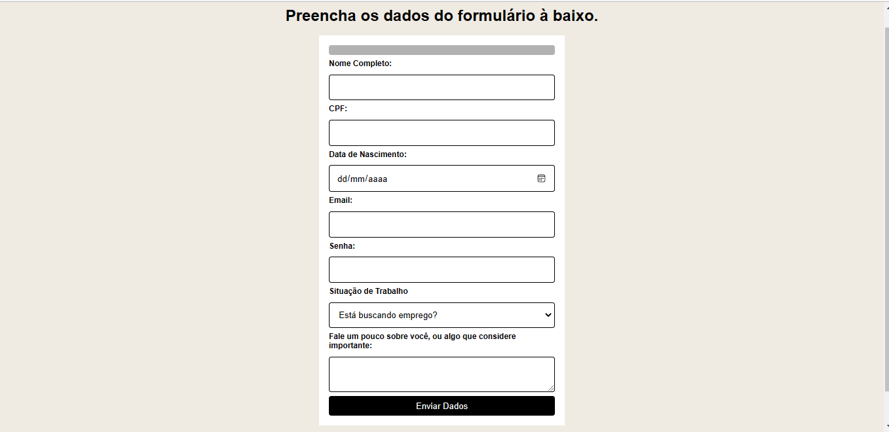

# Validação de formulário

## Sobre o Projeto:

Esse é um formulário de preenchimento obrigatório em todos os campos, onde as validações são feitas por javascript.  Caso o usuário não preencha ou coloque informação inválida aparecerá um modal notificando e a cada resposta informada a barra de progresso vai concluindo.

## Aprendizado adquerido:

Objetivo em fazer esse projeto era aprimorar o javascript utilizando funções, condições, eventos e aprender sobre o regex. 

## Link do Projeto:

https://thmenezes.github.io/ValidacaoFormulario/

## Planejamento do Projeto:

- [x] Criar inputs
- [x] Estilizar formulario
- [x] Criar função de validação
- [x] Criar regex no input email
- [x] Criar barra de carregamento
- [x] Criar modal
- [x] Estilizar modal e barra de carregamento
- [x] Responsividade

## Instruções de uso:

Para que possa baixar esse projeto, será necessário:
* Fazer clone do projeto, no botão verde escrito <>Code.
* Selecionar a opção Download ZIP 
* Ter instalado na máquina um editor de código, no meu caso utilizo Visual Studio Code.

## Ferramentas utilizadas:

### Autora: 

  https://github.com/ThMenezes

